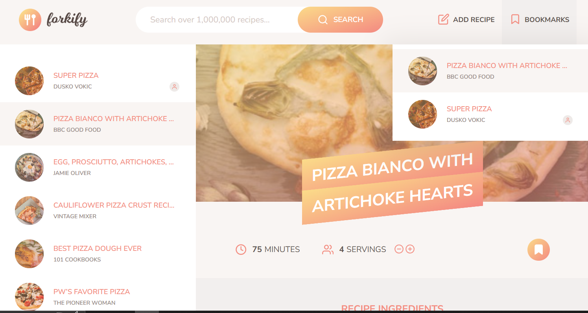

# Forkify — Recipe Search & Bookmarks

**Live:** https://forkify-dusko.netlify.app/  

A modern, client-side recipe app: search over 1,000,000 recipes, view details, scale servings, bookmark favorites, and add your own recipes — all in the browser.

> Based on Jonas Schmedtmann’s Forkify course project. This fork includes refactoring, JSDoc documentation, UI tweaks, and deployment automation.

---

## Table of Contents

- [Features](#features)
- [Tech Stack](#tech-stack)
- [Architecture](#architecture)
- [Screenshots](#screenshots)
- [Getting Started](#getting-started)
- [Scripts](#scripts)
- [Project Structure](#project-structure)
- [API](#api)
- [Quality & Conventions](#quality--conventions)
- [Deployment](#deployment)
- [Roadmap](#roadmap)
- [Acknowledgements](#acknowledgements)
- [License](#license)

---

## Features

- **Search** recipes by keyword (1M+ dataset)
- **Details** view with ingredients, time, and servings
- **Update servings** (auto-recalculates quantities)
- **Bookmarks** (persisted in `localStorage`)
- **Add recipe** via form (client-side validation)
- **Pagination** for large result sets
- **Fast** client-side rendering (no framework)
- **Responsive** and keyboard accessible

---

## Tech Stack

- **JavaScript (ES Modules)** — vanilla, no frameworks
- **Parcel 2** — bundling, dev server, asset pipeline
- **Sass** — styling
- **Core-JS / Regenerator** — polyfills & async runtime
- **fraction.js** — fractional amounts display
- **Netlify** — hosting & CI/CD

---

## Architecture

- **MVC** (Model–View–Controller)
  - `model.js`: central state, API calls, persistence (bookmarks)
  - `views/`: base `View` + specialized views (recipe, results, pagination, bookmarks, add recipe)
  - `controller.js`: orchestrates user actions ↔ state ↔ views
- **Helpers**
  - `helpers.js`: `AJAX()` (GET/POST with timeout)
  - `config.js`: constants (API URL, pagination size, timeouts)

---

## Screenshots

> 

---

## Getting Started

```bash
# 1) Install
npm install

# 2) Run dev server (Parcel)
npm start
# -> http://localhost:1234

# 3) Production build
npm run build
# -> /dist ready to deploy
```

> **Node:** use an active LTS (e.g., 18 or 20). Parcel will warm caches on first run.

---

## Scripts

```json
{
  "start": "parcel index.html",
  "build": "parcel build index.html --dist-dir ./dist --no-cache",
  "format": "prettier -w .",
  "format:check": "prettier -c ."
}
```

- `npm start` — dev server + HMR
- `npm run build` — production bundle to `dist/`
- `npm run format` — format the codebase with Prettier
- `npm run format:check` — check formatting in CI

---

## Project Structure

```
forkify-dusko/
├─ index.html
├─ src/
│  ├─ js/
│  │  ├─ controller.js
│  │  ├─ model.js
│  │  ├─ helpers.js
│  │  ├─ config.js
│  │  └─ views/
│  │     ├─ View.js
│  │     ├─ recipeView.js
│  │     ├─ resultsView.js
│  │     ├─ searchView.js
│  │     ├─ paginationView.js
│  │     ├─ bookmarksView.js
│  │     └─ addRecipeView.js
│  ├─ sass/  (styles)
│  └─ img/   (icons, logo, screenshots)
├─ .prettierrc
├─ .prettierignore
└─ package.json
└─ screenshot.png
```

---

## API

All data comes from the **Forkify API**.

**Base**

```
https://forkify-api.herokuapp.com/api/v2/recipes/
```

**Search**

```
GET ?search=<query>&key=<KEY>
```

**Recipe by id**

```
GET /<id>?key=<KEY>
```

**Create recipe**

```
POST ?key=<KEY>
Content-Type: application/json
Body: {
  title, source_url, image_url, publisher,
  cooking_time, servings,
  ingredients: [{ quantity, unit, description }, ...]
}
```

> For course use, the API key is stored in `src/js/config.js`.  
> For production, move it to an environment variable and inject at build time.

---

## Quality & Conventions

- **JSDoc** across model, controller and views
- **Prettier** for consistent formatting
- Modular ES imports, single-responsibility functions
- Local state persisted to `localStorage` (bookmarks)
- Accessibility: semantic HTML, `alt` text, keyboardable controls

---

## Deployment

- Hosted on **Netlify**: https://forkify-dusko.netlify.app/
- Production build: `npm run build` → deploy `/dist`
- Optional `netlify.toml`:

```toml
[build]
  command = "npm run build"
  publish = "dist"
```

---

## Roadmap

- Move API key to env + build-time injection
- Add unit tests for helpers/model
- Improve error UI and empty states
- Offline caching for icons/assets

---

## Acknowledgements

- Original project by **Jonas Schmedtmann** (course)
- This fork and enhancements by **Duško Vokić**

_Use for learning or portfolio. Not for teaching. Do not claim as original course work._

---

## License

This project is open-sourced under the **MIT License** - see the [LICENSE.md](LICENSE.md) file for details.  
© [Duško Vokić](https://duskovokic.com)

